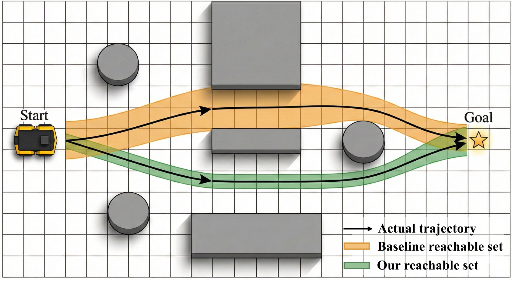
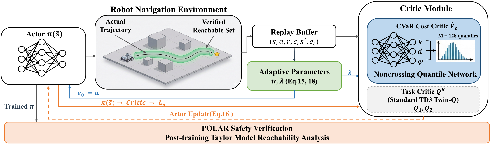

# DRL Robot Navigation with Reachability-Based Safety Verification

Deep Reinforcement Learning for mobile robot navigation in ROS2/Gazebo, extended with **VIA** (*Verification-Informed safe reinforcement learning for Autonomous navigation*) — a CVaR-constrained safe policy paired with POLAR-based post-training reachable set verification.

> 📢 **Accepted at IROS 2026.** This repository accompanies our paper *"Safety-Constrained Reinforcement Learning with Post-Training Reachability Verification for Robot Navigation"* ([arXiv:2605.14174](https://arxiv.org/abs/2605.14174)). If you use this code, please [cite our work](#citation).

[](LICENSE)
[](https://arxiv.org/abs/2605.14174)

<p align="center">
    
</p>
<p align="center"><em>Motivation: CVaR-constrained training keeps larger safety margins, while post-training reachable-set verification certifies actions under observation uncertainty.</em></p>

<p align="center">
    
</p>
<p align="center"><em>Method overview: DRL training &rarr; trajectory collection &rarr; POLAR reachable-set verification.</em></p>

## Contents

- [Attribution](#attribution)
- [Requirements](#requirements)
- [Installation](#installation)
- [Training](#training)
- [Post-Training: Trajectory Collection &rarr; Reachable Set Verification](#post-training-trajectory-collection--reachable-set-verification)
- [Project Structure](#project-structure)
- [Citation](#citation)
- [License](#license)

## Attribution

This repository extends the following open-source work:

- **Base codebase & simulation environment**: [reiniscimurs/DRL-Robot-Navigation-ROS2](https://github.com/reiniscimurs/DRL-Robot-Navigation-ROS2) — ROS2 DRL navigation framework (TD3/SAC, Gazebo). Our Gazebo/TurtleBot3 simulation setup follows this repository; please refer to it for environment installation and configuration details.
- **ROS2 adaptation**: [tomasvr/turtlebot3_drlnav](https://github.com/tomasvr/turtlebot3_drlnav)
- **TD3 implementation**: [reiniscimurs/DRL-robot-navigation](https://github.com/reiniscimurs/DRL-robot-navigation)

**Extensions in this repository:**

- `TD3_lightweight`: compact TD3 (hidden_dim=26) compatible with POLAR reachability verification
- `TD3_VIA`: TD3 with VIA's CVaR-constrained safety objective (augmented state s̄ = (s, eₜ), noncrossing quantile cost critic) for safe DRL navigation
- POLAR reachable set computation via Taylor Model arithmetic and Bernstein polynomial approximation
- Trajectory collection and parallel verification pipeline

**Scope of this repository.** This code covers the Gazebo/TurtleBot3 **simulation** training and the
post-training reachability verification for our method (`TD3_VIA`) and the `TD3_lightweight` baseline.
The other baselines reported in the paper (TD7, SAC-Lagrangian, RCPO, WCSAC, CVaR-CPO) and the
real-world sim-to-real experiments on the **Clearpath Jackal** are not included here.

## Requirements

| Component | Version |
| --- | --- |
| OS       | Ubuntu 20.04 |
| ROS2     | Foxy |
| Python   | 3.8.10 |
| PyTorch  | ≥ 1.10 |

**Python packages:** `torch` (≥ 1.10), `numpy`, `sympy` (reachable-set verification), `squaternion` (ROS pose conversion), `tqdm`, `tensorboard` (training logs)

The ROS2, Gazebo, and TurtleBot3 simulation packages are installed during [Installation](#installation) via `rosdep`.

## Installation

```bash
git clone https://github.com/memory009/VIA.git
cd VIA

sudo apt install python3-rosdep2
rosdep update
rosdep install -i --from-path src --rosdistro foxy -y
sudo apt install python3-colcon-common-extensions
colcon build
```

Set up environment variables (add to `~/.bashrc` or run each session):

```bash
export ROS_DOMAIN_ID=1
export DRLNAV_BASE_PATH=~/VIA
export GAZEBO_MODEL_PATH=$GAZEBO_MODEL_PATH:~/VIA/src/turtlebot3_simulations/turtlebot3_gazebo/models
export TURTLEBOT3_MODEL=waffle
source /opt/ros/foxy/setup.bash
source install/setup.bash
```

## Training

All training scripts are run from the repository root with the Gazebo simulator running in a separate terminal.

**Terminal 1 — launch Gazebo:**

```bash
ros2 launch turtlebot3_gazebo ros2_drl.launch.py
```

### Baseline: TD3_lightweight

Trains the compact TD3 model (hidden_dim=26) used as the baseline:

```bash
# Terminal 2
python3 src/drl_navigation_ros2/train.py

# Optional arguments
python3 src/drl_navigation_ros2/train.py --max-epochs 100 --episodes-per-epoch 70
```

Model weights are saved to (filename prefix `TD3`, e.g. `TD3_actor.pth`):
```
src/drl_navigation_ros2/models/TD3/<run_id>/TD3_*.pth
```

### VIA: Safe Navigation with CVaR Constraint

Trains the VIA model (augmented state s̄ = (s, e_t), noncrossing quantile cost critic):

```bash
# Terminal 2
python3 src/drl_navigation_ros2/train_VIA.py

# Optional arguments
python3 src/drl_navigation_ros2/train_VIA.py --max-epochs 100 --episodes-per-epoch 70
```

Model weights are saved to (filename prefix `TD3_VIA`, e.g. `TD3_VIA_actor.pth`):
```
src/drl_navigation_ros2/models/TD3_VIA/<run_id>/TD3_VIA_*.pth
```

Both `train.py` and `train_VIA.py` save under `src/drl_navigation_ros2/models/<model>/<run_id>/`, which is exactly where the verification scripts look for weights — no manual move required.

**Monitor training** (either model):
```bash
tensorboard --logdir runs
```

## Post-Training: Trajectory Collection → Reachable Set Verification

Once you have a trained model, the verification workflow is two steps:

### Step 1 — Collect Trajectories

Edit the **User Configuration** block at the top of the script:

```python
# src/drl_navigation_ros2/scripts/collect_trajectories.py

model_type  = "TD3_Lightweight"           # "TD3_Lightweight" or "TD3_VIA"
model_name  = "TD3_best"                   # filename prefix of the saved weights (TD3_best_*.pth)
model_dir   = project_root / "models" / "TD3" / "<your_run_id>"
output_name = "trajectories_td3_v1"       # output filename (saved as assets/<output_name>.pkl)
```

Then run with Gazebo active:

```bash
# Terminal 1 (if not already running)
ros2 launch turtlebot3_gazebo ros2_drl.launch.py

# Terminal 2
python3 src/drl_navigation_ros2/scripts/collect_trajectories.py
```

Output: `src/drl_navigation_ros2/assets/<output_name>.pkl`

### Step 2 — Reachable Set Verification

Edit the **User Configuration** block in the verification script:

```python
# src/drl_navigation_ros2/scripts/reachable_set_verification.py  (lines ~510-525)

# For TD3_Lightweight:
model_name      = "TD3_best"     # train.py saves the best checkpoint as TD3_best_*.pth
model_path      = project_root / "models" / "TD3" / "<your_run_id>"
trajectory_path = project_root / "assets" / "<your_trajectory_file>_v1.pkl"

# For TD3_VIA:
model_name      = "TD3_VIA_best"  # train_VIA.py saves the best checkpoint as TD3_VIA_best_*.pth
model_path      = project_root / "models" / "TD3_VIA" / "<your_run_id>"
trajectory_path = project_root / "assets" / "<your_trajectory_file>_v1.pkl"
```

Then run (no Gazebo required):

```bash
# TD3_Lightweight
python3 src/drl_navigation_ros2/scripts/reachable_set_verification.py \
    --model-type TD3_Lightweight --version v1

# TD3_VIA
python3 src/drl_navigation_ros2/scripts/reachable_set_verification.py \
    --model-type TD3_VIA --version v1

# Optionally override e_t for TD3_VIA (defaults to the value stored in the checkpoint)
python3 src/drl_navigation_ros2/scripts/reachable_set_verification.py \
    --model-type TD3_VIA --version v1 --e-t 5.0
```

The script runs verification in parallel across CPU cores. Output includes per-trajectory safety rates and an aggregate **Safety Rate** — the proportion of evaluated states whose reachable action set stays within the safety margin under bounded observation uncertainty (the metric reported in the paper).

## Project Structure

```
src/drl_navigation_ros2/
├── train.py                        # Baseline (TD3_lightweight) training entry point
├── train_VIA.py                    # VIA training entry point
├── TD3/
│   ├── TD3_lightweight.py          # Compact TD3 (hidden_dim=26, POLAR-compatible)
│   ├── TD3_VIA.py                  # TD3 + VIA safety constraint
│   └── TD3.py                      # Original full-size TD3 (reference)
├── replay_buffer.py                # Standard replay buffer
├── via_replay_buffer.py            # VIA replay buffer (8-tuple with e_t tracking)
├── ros_python.py                   # ROS2/Gazebo environment wrapper (ROS_env)
├── ros_nodes.py                    # ROS2 publisher/subscriber nodes used by ros_python.py
├── pretrain_utils.py               # Pre-training from an offline buffer (assets/data.yml)
├── utils.py                        # Evaluation scenario utilities
├── scripts/
│   ├── collect_trajectories.py     # Collect rollout trajectories from a trained model
│   └── reachable_set_verification.py  # Parallel POLAR reachable set verification
├── verification/
│   ├── taylor_model.py             # Taylor Model arithmetic core (used by the verifier)
│   ├── polar_verifier.py           # POLAR layer-by-layer propagation
│   └── ray_casting.py              # Laser scan prediction via ray-box intersection
└── assets/
    ├── data.yml                    # Offline buffer for warm-start pre-training (train.py)
    ├── eval_scenarios_8_polar.json # Combined evaluation scenarios (collect_trajectories.py)
    ├── obstacle_map.json           # Single-map geometry for verification/ray_casting.py
    └── eval_scenarios_8_polar/     # Per-scenario obstacle maps for verification
        └── obstacle_map_scenario_00..09.json
```

> **Note on `data.yml`.** This is a ~39 MB offline replay buffer used by `train.py` to warm-start
> training (`load_saved_buffer = True`). To train the baseline from scratch instead, set
> `load_saved_buffer = False` in `train.py`.

## Citation

If you find this work useful, please cite our paper:

```bibtex
@inproceedings{he2026safety,
  title     = {Safety-Constrained Reinforcement Learning with Post-Training Reachability Verification for Robot Navigation},
  author    = {He, Qisong and Huang, Xinmiao and Hu, Jinwei and Li, Zhuoyun and Dong, Yi and Wu, Changshun and Huang, Xiaowei},
  booktitle = {2026 IEEE/RSJ International Conference on Intelligent Robots and Systems (IROS)},
  year      = {2026},
  eprint    = {2605.14174},
  archivePrefix = {arXiv},
  primaryClass  = {cs.RO}
}
```

## License

This project is released under the [MIT License](LICENSE).

It builds on [reiniscimurs/DRL-Robot-Navigation-ROS2](https://github.com/reiniscimurs/DRL-Robot-Navigation-ROS2) (MIT), [tomasvr/turtlebot3_drlnav](https://github.com/tomasvr/turtlebot3_drlnav), and [reiniscimurs/DRL-robot-navigation](https://github.com/reiniscimurs/DRL-robot-navigation). Please also respect the licenses of these upstream projects.
